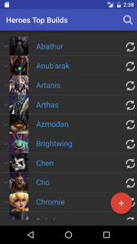
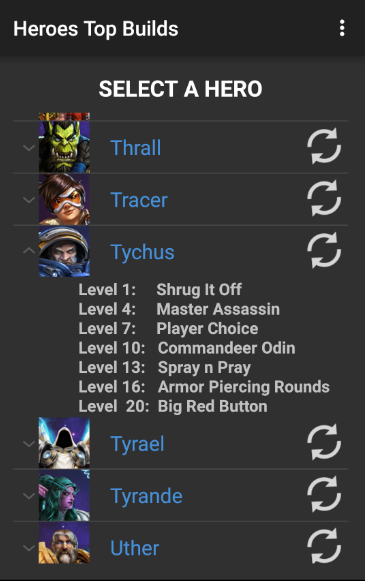
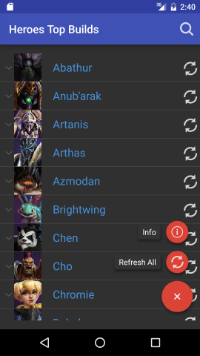

# HeroesApp
Heroes Top Builds App

    

## Technologies Used:
<li> [JSoup](https://github.com/jhy/jsoup)
<li> [Espresso](https://github.com/googlesamples/android-testing)
<li> [Clans Floating Action Button](https://github.com/Clans/FloatingActionButton)
<li> SQLite Database
<li> AsyncTasks </li>

